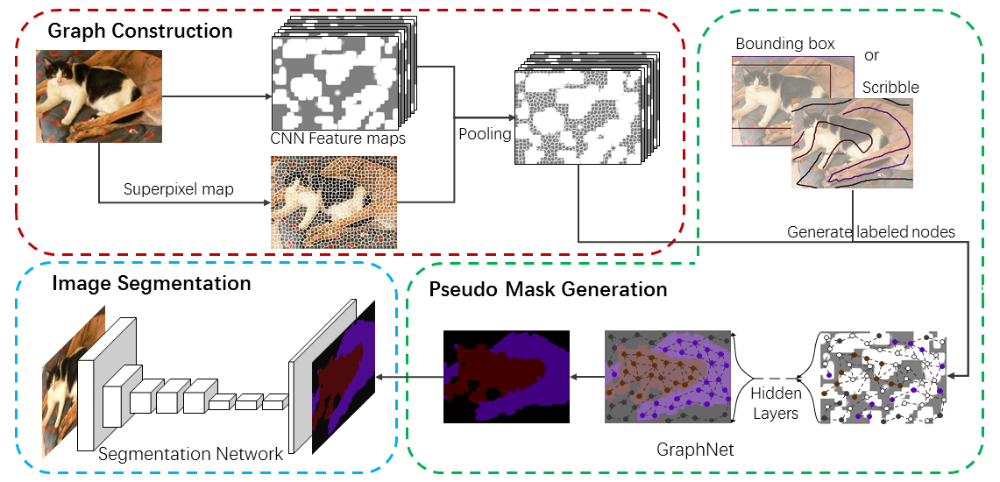
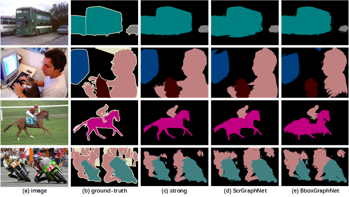
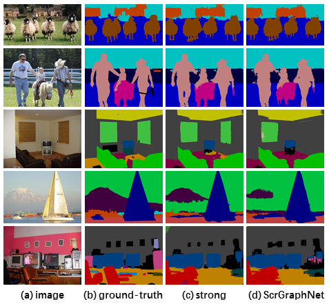

# GraphNet
GraphNet: Learning Image Pseudo Annotations for Weakly-Supervised Semantic Segmentation, in ACM Multimedia 2018 (oral) [[Paper]](https://github.com/MengyangPu/GraphNet/blob/master/GraphNet%20.pdf)

## Overview


### Implementation Details
The network architecture of [DeepLabv2-VGG16](https://github.com/TheLegendAli/DeepLab-Context2) serves as our network architecture of scribble and bounding box annotations experiments.

### Results
> #### Results on the PASCAL VOC 2012 dataset
  method                      | annotation    | w/o CRF       | w/ CRF 
  --------------------------- | ------------- | ------------- | -------------
  Ours: ScrGraphNet, Initial  | scribble      |  63.3         |  68.2
  Ours: ScrGraphNet, 1-Round  | scribble      |  64.5         |  68.9
  Ours: BboxGraphNet, Initial | bounding box  |  57.1         |  63.4
  Ours: BboxGraphNet, 1-Round | bounding box  |  61.3         |  65.6
 

> #### Results on the PASCAL-CONTEXT dataset
  method                      | w/o CRF       | w/ CRF 
  --------------------------- | ------------- | -------------
  Ours: ScrGraphNet, Initial  | 33.1          | 39.7
  Ours: ScrGraphNet, 1-Round  | 33.9          | 40.2
  


## Citation 
If you find the paper useful for your research, please cite:
```bibtex
@INPROCEEDINGS{Pu2018GraphNet,
    author = {Pu, Mengyang and Huang, Yaping and Guan, Qingji and Zou, Qi},
    title = {GraphNet: Learning Image Pseudo Annotations for Weakly-Supervised Semantic Segmentation},
    booktitle = {ACM Multimedia},
    year = {2018}
}
```
